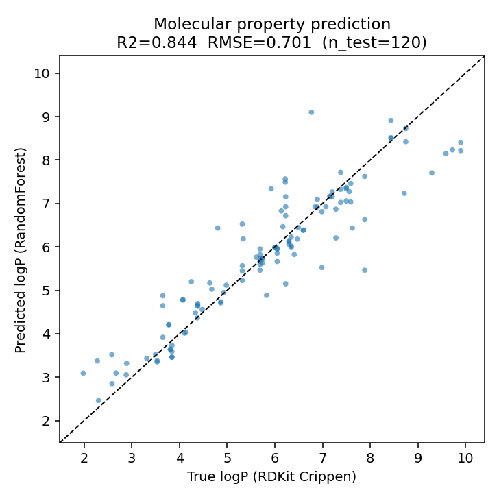

# ai4science-lab

A small portfolio of **AI-for-Science** experiments, bridging a quant / high-dimensional
predictive-modeling background into computational drug discovery and cell biology.


## Projects

### 1. `molecular-property-prediction/` — QSPR baseline (DeepChem-style)
**Problem.** Predict a molecular property directly from chemical structure (SMILES) —
the core loop behind virtual screening and ADMET prediction.

**Method.** `SMILES → Morgan fingerprints (2048-bit, radius 2) → RandomForest regression`,
with a held-out test split and 5-fold cross-validation. The molecule library is generated
**offline** via BRICS fragment recombination (no network needed), and the target is
RDKit-computed Crippen logP. Featurization / training / evaluation are dataset-agnostic:
point `load_dataset()` at a real assay CSV (MoleculeNet BBBP / BACE / Tox21 / ESOL) and the
rest is unchanged.

**Results.** (seed=42, 600 molecules, 480 train / 120 test)

| metric | value |
|---|---|
| Test R² | **0.84** |
| Test RMSE | 0.70 logP units |
| 5-fold CV R² | 0.79 ± 0.04 |

**Figure.** `molecular-property-prediction/results/parity_plot.png`



**Run.**
```bash
cd molecular-property-prediction
pip install -r requirements.txt
python predict_logp.py
```

### 2. `single-cell/` — scRNA-seq analysis pipeline (scvi-tools-style)
**Problem.** Recover cell types from single-cell RNA-seq when a **batch effect**
confounds the signal — the data-integration problem scVI is built for.

**Method.** Simulate counts (6 cell types × 2 batches, ~30% dropout) → normalize +
log1p → PCA → KMeans clustering; then a per-batch z-score **batch correction** and a
RandomForest cell-type classifier (label transfer). Counts are simulated offline;
point the loader at a real AnnData (scanpy / scvi-tools) and the steps are identical.

**Results.** (seed=0, 3000 cells, 800 genes)

| metric | before correction | after correction |
|---|---|---|
| Clustering ARI vs. true types | 0.29 | **1.00** |
| Batch silhouette (→0 = well mixed) | 0.18 | **0.00** |
| Cell-type classifier accuracy | — | **0.996** |

Batch correction takes clustering from near-random (ARI 0.29) to near-perfect — the
core value scVI-style integration adds.

**Figure.** `single-cell/results/sc_embedding.png`

**Run.** `cd single-cell && python sc_pipeline.py`

## Roadmap (next)
- [ ] Swap in a real MoleculeNet assay (BBBP / BACE) + scaffold split (no leakage)
- [ ] Add a graph-neural-net baseline (compare vs fingerprints)
- [x] `single-cell/` — scRNA-seq pipeline (KMeans + batch correction + RF cell typing) ✅
- [ ] Upgrade `single-cell/` to a real dataset + actual **scvi-tools** latent model
- [ ] Epigenetic-clock regression on public methylation data (the "rejuvenation" narrative)

## Stack
Python · RDKit · scikit-learn · pandas · matplotlib
